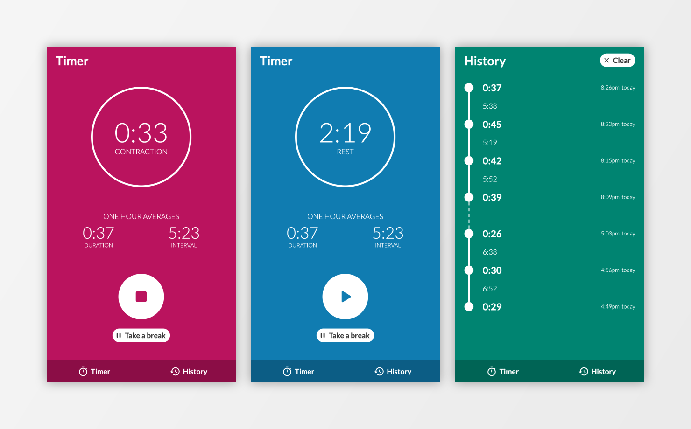

# Contraction timer

A minimalist web app for timing and tracking labour contractions.

## Try it out

https://contractions.netlify.app

## Background

I tested several contraction timers for my wife's first labour and found them unnecessarily complicated and unintuitive. I thought there was a better way, so I decided to build it.

I've kept the interface as minimal as possible while still providing all the necessary information to track your labour's progress. The app is web-based for quick access on any device, and can also be installed as a PWA.

## Features

**Get real-time stats** - Time your current contraction or rest period, and take a break at any time. One hour averages, used to determine your labour stage, are continuously calculated and prominently displayed.

**Follow your progress** - The history view lists all your previous contractions and intervals, so you can see how your labour is developing.

**At-a-glance updates** - Each timer state has a distinctive background colour, giving you corner-of-the-eye information and allowing you to stay focused on your partner.

**Jump straight in** - Runs in the browser on any device without installation or registration, allowing you to get started at a moment's notice. Or add it to your device's home screen for quick, full-screen access.

**Never lose anything** - Your data is mirrored to local storage for peace of mind. Close your browser, use other apps or even restart your phone - the timer will keep running and your contraction history will be safe.

## Technologies
[React](https://reactjs.org/),
[Redux](https://redux.js.org/),
[TypeScript](https://www.typescriptlang.org/),
[styled-components](https://styled-components.com/),
[Framer Motion](https://www.framer.com/motion/),
[Moment](https://momentjs.com/),
[ESLint](https://eslint.org/),
[stylelint](https://stylelint.io/),
[Jest](https://jestjs.io/),
[React Testing Library](https://testing-library.com/docs/react-testing-library/intro/).
