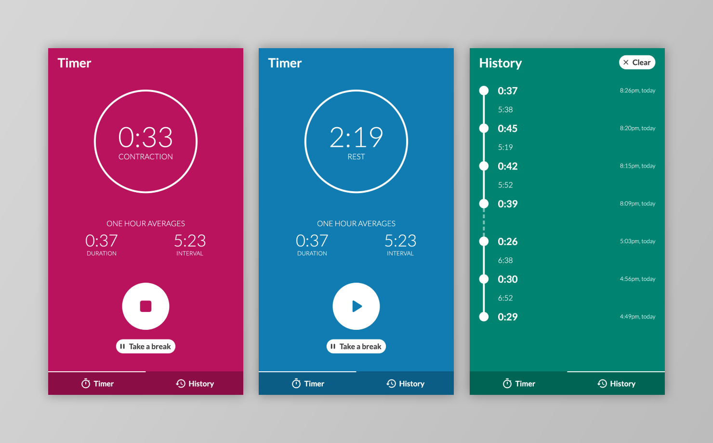

# Contractions timer
A minimalist web app for tracking and timing your contractions during labour.

## Why I built it
Used contraction timers in wife's first labour and they weren't great, so decided to build my own. Also didn't particularly want to install an app for something I'd only use once, so decided to build a web based one.

## Live demo

## Installation

## Tech (add as tags?)
* TypeScript
* Redux
* React
* Jest
* React Testing Library
* LocalStorage
* Styled components
* ESLint
* Framer motion (not much)
* Moment
* Stylelint

## Testing
* Jest and RTL
* Have tested utils and store directly, then the app as a bunch of integration-style tests as per Kent C Dodd' ethos. Gives greater confidence in fewer tests.
* Big fan of RTL - forces you to test more like a user 

## PWA

## General
* Focus outlines when navigating by keyboard.
* Components responsible for fetching their own data, to prevent lots of prop drilling and allow easier refactors.
* Some interesting hooks, particularly useForceUpdate (used to update a component even when state doesn't change) and intervalUpdate (updates a component on an interval even when state hasn't changed).
* State (worth making its own point) - chose to keep this as static as possible rather than updating times in state. This allows each component to control how often it's updated (rather than having a global "refresh rate"), e.g. Averages component which changes its interval depending on whether the clock is ticking or not (also search for UPDATE_INTERVAL as different components have different refresh rates). Having this sort of "pure" state also means you can navigate away or even completely close the tab, and when you come back things will be correct. Doing it the other way would require you to have it open and running all the time.
* State is mirrored to LocalStorage so it can be rehydrated if you close and reopen the tab - handy when labour lasts hours and you're not always fully focused on the app.
* State configured using Redux Toolkit to cut down on boilerplate.
* Accessibility - have tried hard to make it highly accessible. RTL helps a lot by encouraging you to access content using ARIA roles, etc.
* Styling - used styled components, prefixed each component with "Styled" to distinguish. Overall it's ok, I like how you can easily use logic in your styles, but I don't really like how it reads (e.g. <ul> and then <StyledListItem>).
* Theme file allows customisation of colours, fonts, borders, spacing, transitions, etc in a central place.
* Theme helpers. Some are placeholders for fetching values (spacing, font size, etc). Others return CSS (breakpoint). statusColor performs logic to return the correct value. All helps keep the code DRY.
* TypeScript - wouldn't start a project without it, it gives you so much confidence and makes your code so much more robust.
* When talking about a specific file, link to it.
* Components - kept very small and composed. Each has a single responsibility for easy maintenance and reusability.
* Redux - chose this because some of the state logic is quite complex. Could use React's useReducer but usage wasn't quite as nice so I stuck with the tried-and-tested solution.
* UX - simple and uncluttered. Colours indicate current state (contraction, rest, taking a break) at a glance - useful out of the corner of your eye while helping wife. Animated circle reinforces state. One hour averages are the standard way of pinpointing what stage of labour you're in, so they're prominent. Full history if you want it. Can leave site altogether and come back and state will be rehydrated from localStorage - means the timer will keep running, history will be preserved, etc.
